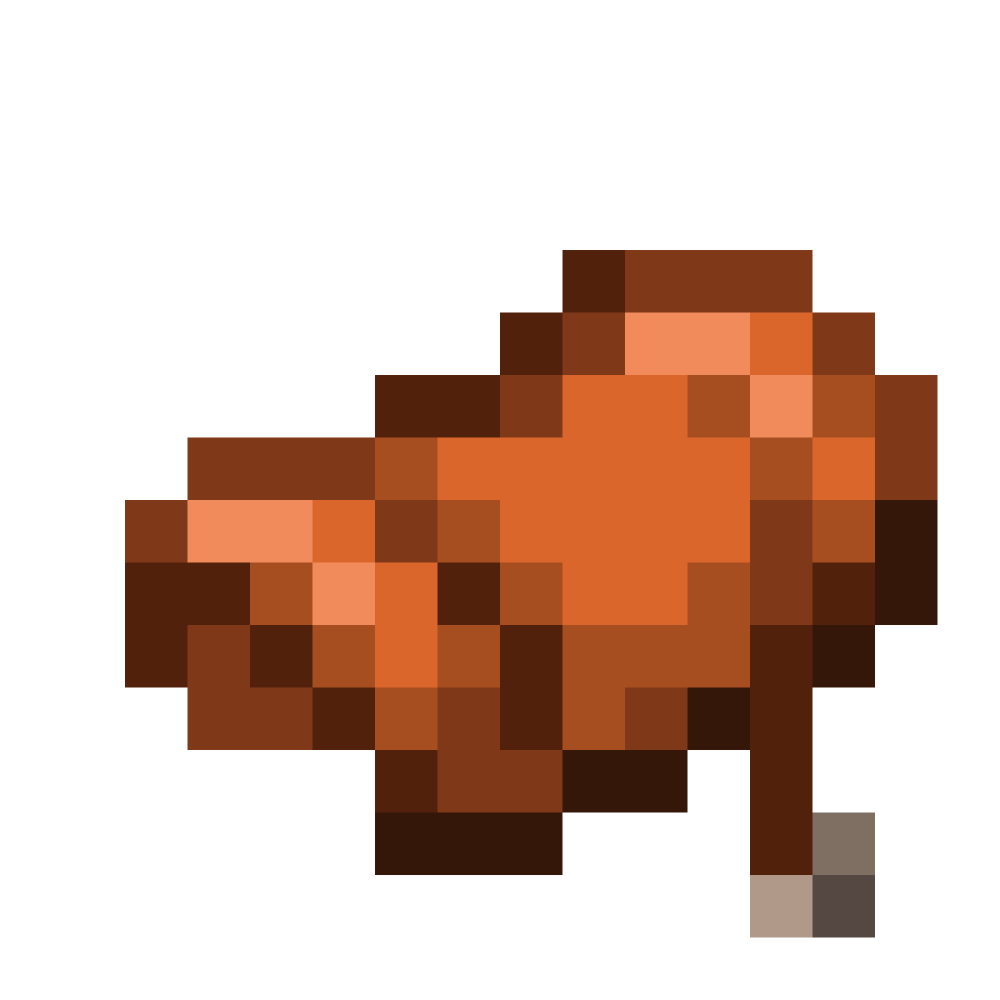

<h1 align="center">
   
  Simply Saddles
</h1>

* A datapack for Minecraft 1.21.5

## Features

Adds a simple and fair recipe to craft saddles into Minecraft!

## Recipe

Craft a saddle using 4 leather, 2 string and 2 iron!
## Installation

Download the latest release from [here](https://github.com/IViddyy/simply-saddles/releases/latest) and put the datapack zip file into the `datapacks` folder of your Minecraft world.

Also available on Modrinth!

<a href="https://modrinth.com/datapack/simply-saddles">
<picture>
  <source height="72px" media="(prefers-color-scheme: dark)" srcset="https://raw.githubusercontent.com/Tschipcraft/badges/main/assets/modrinth-badge-dark.svg">
  <source height="72px" media="(prefers-color-scheme: light)" srcset="https://raw.githubusercontent.com/Tschipcraft/badges/main/assets/modrinth-badge-light.svg">
  
</picture>
</a>
